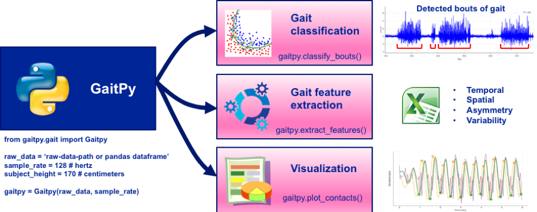

# Introduction

Gait impairments are present across a broad range of conditions and often have a significant impact on the functional mobility and quality of life of an individual. Clinicians and researchers commonly assess gait using either observational scales (e.g. Unified Parkinson's Disease Rating Scale) or performance-based tests (e.g. timed-up-and-go). However, these assessments can only be performed intermittently because of the need for a trained clinician. In contrast, wearable devices can be used for continuously capturing data from sensors (e.g. accelerometer, ECG) outside the clinic. Recently, several groups [@McCamley2012; @Zijlstra2003; @DelDin2016; @Trojaniello2014] have published algorithms for deriving features of gait from data collected using inertial sensors like accelerometers. However, an implementation of these algorithms is not readily available to researchers, thus hindering progress.

GaitPy is an open-source Python package that implements several published algorithms in a modular framework for extracting clinical features of gait from a single accelerometer device mounted on the lower back (L5 vertebra, illustrated in figure 1). The package has been developed to make it easy for researchers to derive measures of gait from raw accelerometer data. As shown in figure 2, the package includes modules with three main functions: 1) classify bouts of gait; 2) extract clinical features of gait from each bout; and 3) visualize detected gait events.

{width=200px}

# Processing Pipeline

GaitPy can be used to derive gait features from data collected in the clinic as well as under free-living conditions (e.g. at home). The package accepts input data in a customizable format, thereby not restricting the user to a standard file type. GaitPy utilizes vertical acceleration data from a wearable device located on the lower back (lumbar region) and consists of three main processing modules.

**classify_bouts** is an optional module intended to be used for processing data collected under free-living or unsupervised conditions. The module uses a pre-trained gait classification model to detect bouts of gait from a continuous stream of raw accelerometer data. It first converts data to units of gravity (g) and down-samples it to 50Hz. Data is then segmented into non-overlapping 3-second epochs and signals features are derived for each epoch. The pre-trained gait classification model then classifies each 3-second epoch as gait or not-gait.

**extract_features** module utilizes a Gaussian continuous wavelet transform based approach [@McCamley2012] and inverted pendulum model [@Zijlstra2003] to calculate spatial and temporal gait features. Vertical acceleration data is first converted from units of gravity (g) to meters per second squared (m/s2) and down-sampled to 50Hz. Using the approach described in Del Din et al. 2016 [@DelDin2016], we then derive spatial and temporal features of gait. Additionally, an optimization procedure is performed to remove extraneous event detections and is described in more detail below. The extract_features module expects data segments that only contain gait. So, if input data consists of both gait and non-gait data, it is recommended to first apply the classify_bouts function in order to identify periods of gait at the resolution of 3-second epochs. extract_features will then concatenate concurrent 3-second epochs of gait into bouts and extract features for each bout.

**plot_contacts** module generates an interactive plot of raw data along with the initial and final contact events detected by the gait event detection algorithm [@McCamley2012]. The plot facilitates debugging and presentation of results.

# Outputs

As shown in figure 2, the outputs of GaitPy modules include classification of gait bouts, a set of gait feature values extracted for each bout, and a plot of raw sensor data marked with detected gait events (initial contact/heel strike and final contact/toe off). We describe outputs of each of the processing modules below:

**classify_bouts** generates a pandas dataframe or a h5 file containing the following columns:

a. window_start_time: Unix timestamp associated with the beginning of each 3-second epoch in the data.
b. window_end_time: Unix timestamp associated with the end of each 3-second epoch in the data.
c. prediction: Output of the gait classification model (1=gait or 0=not gait) for each 3-second epoch in the data.

**extract_features** generates a pandas dataframe or a csv file containing:

a. Bout number for each bout detected by classify_bouts (column name: bout_number).
b. Length of bout in seconds (column name: bout_length_sec).  
c. Start time of bout (column name: bout_start_time).
d. Total number of steps detected within each bout (column name: steps).
e. Initial and final contact event timestamps in Unix time (column names: IC and FC respectively).
f. Values of the following gait features are derived per stride: stride duration, step duration, cadence, initial double support, terminal double support, double support, single limb support, stance, swing, step length, stride length, gait speed. In addition, we calculate variability and asymmetry associated with a set of features.

**plot_contacts** generates a HTML file containing an interactive time-series plot of raw vertical acceleration data labeled with detected gait events and bouts (shown in figure 3).

a. Initial contact: The moment in the gait cycle when foot touches the ground (i.e. heel strike)
b. Final contact: The moment in the gait cycle when foot lifts off the ground (i.e. toe off)
c. Gait bouts: A green vertical line marks the beginning of each detected gait bout and a red vertical line marks the end of the bout (Figure 3).

{width=450px}

# Algorithms

GaitPy includes two key algorithms for processing raw accelerometer data to derive gait features. The first algorithm is used for detecting bouts of gait from continuous accelerometer data collected under free-living conditions and the second algorithm derives temporal and spatial features of gait from pre-identified bouts of gait. Below is a brief description of the algorithms.

**Gait Classification**  
In order to derive gait features from data collected under free-living conditions, it is essential to identify periods of walking activity. GaitPy includes a pre-trained random forest [@Breiman2001] binary classifier that operates on time and frequency domain features extracted from 3-second epochs of vertical acceleration data. Prior to feature extraction, raw vertical acceleration data is down-sampled to 50Hz and band-pass filtered using a 0.5-3Hz 1st order Butterworth filter. Extracted signal features include dominant frequency, the ratio of the energy associated with the dominant frequency component to the total energy, the range of amplitude, the root mean square value of the signal, and the signal entropy. Gaitpy's classify_bouts module applies this binary classifier to input data to classify each non-overlapping 3-second epoch as either gait or not-gait.

**Gait Features**  
GaitPy implements a slightly modified version of a Gaussian continuous wavelet-based method [@McCamley2012] and an inverted pendulum model [@Zijlstra2003] to extract features from data collected during bouts of gait.

Three post-processing steps are applied to remove extraneous stride detections beyond physiological limits.
Step 1: Strides longer than 2.25 seconds or shorter than 0.25 seconds are removed. [@Najafi2003]
Step 2: Strides with stance times exceeding 70% of the maximal stride time of 2.25 seconds are removed. [@Hollman2011]
Step 3: Strides with an initial double support that exceed 20% of the maximal stride time of 2.25 seconds are removed. [@Hollman2011]

# Acknowledgements
The Digital Medicine & Translational Imaging group at Pfizer, Inc supported the development of this package.

# License
This project is licensed under the MIT License - see the LICENSE.md file for details

# References
